# Comprehensive Guide: MERN Session Authentication & Next.js Integration

This guide provides an in-depth, step-by-step breakdown of how session-based authentication works in your MERN stack application, how the authentication state is checked, and how we solved the Next.js Server Component cookie forwarding challenge.

---

## 1. High-Level Architecture Overview

In a typical MERN application, the React frontend and Express backend run on different ports (e.g., `localhost:3000` and `localhost:5000`). To secure routes on the frontend, we must verify the user's authentication state against the backend before displaying protected pages.

There are two primary paradigms in Next.js for checking authentication:
1. **Client-Side Authentication:** Performed within a Client Component (`"use client"`). The browser initiates the request, automatically including cookies.
2. **Server-Side Authentication:** Performed inside a Next.js Server Component. The Next.js Node.js server acts as a proxy to make the request to the Express backend, requiring **manual cookie forwarding**.

Below is a sequence diagram illustrating both processes:

```mermaid
sequenceDiagram
    autonumber
    rect rgb(10, 10, 20)
    note right of Browser: CLIENT-SIDE FLOW (e.g., Login / Register)
    Browser->>Express Server: POST /login (with email, password)
    Express Server->>MongoDB: Query user & verify hash
    MongoDB-->>Express Server: User record
    Express Server->>Express Server: Generate Session in Memory Store
    Express Server-->>Browser: HTTP 201 + Set-Cookie (connect.sid)
    note over Browser: Browser automatically saves the session cookie
    end

    rect rgb(20, 10, 10)
    note right of Browser: SERVER-SIDE FLOW (Next.js Server Component accessing /home)
    Browser->>Next.js Server: Navigates to /home
    note over Next.js Server: Next.js reads request cookies using cookies()
    Next.js Server->>Express Server: GET /auth-check (with Cookie: connect.sid=...)
    Express Server->>Express Server: Looks up connect.sid in Session Store
    alt Session is Valid
        Express Server-->>Next.js Server: HTTP 200 { authenticated: true, user: ... }
        Next.js Server-->>Browser: Renders dashboard HTML & displays page
    else Session is Invalid / Missing
        Express Server-->>Next.js Server: HTTP 401 { authenticated: false }
        Next.js Server-->>Browser: Redirects to /login
    end
    end
```



---

## 2. Deep Dive: How Session State is Stored & Checked

Your application uses **session-based authentication** (via `express-session`). Unlike token-based authentication (like JWTs) where state is stored on the client, session-based authentication stores user session data **on the server**, sending only a signed session ID to the client.

### Step A: Session Creation (Express Backend)
When the user logs in successfully via `/login`, the session middleware initializes a session object and generates a unique session ID.

```javascript
// From server.js
req.session.user = {
  id: user._id,
  email: user.email,
};
```

1. **Session Store:** By default, `express-session` keeps session data in a `MemoryStore` (RAM) on the Node server.
2. **Cookie Dispatch:** The backend sends the session ID back to the client in the `Set-Cookie` header. In your Express configuration:
   ```javascript
   session({
     secret: process.env.SESSION_SECRET, // Signs the cookie to prevent tampering
     resave: false,
     saveUninitialized: false,
     cookie: {
       maxAge: 1000 * 60 * 60 * 24, // Cookie expires in 1 day
       httpOnly: true, // Prevents client-side JS from reading the cookie (protects against XSS)
     },
   })
   ```
   The cookie is named `connect.sid` by default. Because of `httpOnly: true`, malicious scripts cannot access it via `document.cookie`.

---

## 3. CORS & Browser Security Configurations

Because your client (`3000`) and server (`5000`) run on different origins, the browser's **Same-Origin Policy** restricts cross-origin HTTP requests. To exchange session cookies securely, two options must align:

### 1. Express CORS Middleware Configuration
The backend must explicitly declare that it trusts the client origin and permits credentials (cookies) to be sent:
```javascript
// From server.js
app.use(
  cors({
    origin: "http://localhost:3000", // Allows only your React app to communicate
    credentials: true,               // Allows browser to send cookies/headers
  }),
);
```

### 2. Client Axios Configuration
When making requests from the browser (e.g., in `src/components/login.jsx`), Axios must be configured to pass credentials:
```javascript
const response = await axios.post(
  "http://localhost:5000/login",
  { email, password },
  { withCredentials: true } // Crucial! Directs the browser to include and set cookies
);
```
Without `withCredentials: true` on the client and `credentials: true` on the server, the browser will block the `Set-Cookie` header from being stored, and subsequent requests won't attach the session cookie.

---

## 4. Why the Home Page Failed (Server Components vs. Client Components)

In Next.js, files under `src/app/` are **Server Components** by default unless prefixed with `"use client"`. 

### The Bug Scenario
The home page (`src/app/home/page.js`) was executing:
```javascript
export default async function Home() {
  try {
    const isAuthenticated = await axios.get("http://localhost:5000/auth-check");
    // ...
  } catch (error) {
    return redirect("/login");
  }
}
```

* **What happened?** 
  When the browser navigated to `/home`, the rendering occurred **on the Next.js Node.js server**. The `axios.get` call was initiated by the Next.js server, **not** the user's browser.
* **Why did it fail?**
  Axios running on the server has no connection to the browser's cookie storage. It sent a completely raw, cookieless HTTP request to `http://localhost:5000/auth-check`.
* **The result:**
  The Express server saw no `connect.sid` cookie, treated it as unauthenticated, and returned a `401 Unauthorized` response. Next.js caught this as an error and redirected the browser back to `/login` permanently.

---

## 5. The Solution: Cookie Forwarding in Next.js Server Components

To resolve this issue, we manually read the cookie header from the incoming request to the Next.js server, and pass it directly into the outgoing Axios request to the Express backend.

```javascript
import axios from "axios";
import { redirect } from "next/navigation";
import { cookies } from "next/headers"; // Next.js utility to read request cookies

export default async function Home() {
  let isAuthenticated = false;
  let userEmail = "";

  try {
    // 1. Retrieve the cookies sent by the browser to the Next.js server
    const cookieStore = await cookies();
    const cookieHeader = cookieStore.toString(); // e.g. "connect.sid=s%3A..."

    // 2. Explicitly forward the cookie header to the backend
    const response = await axios.get("http://localhost:5000/auth-check", {
      headers: {
        Cookie: cookieHeader, // Backend session middleware now reads this correctly!
      },
    });

    if (response.data?.authenticated) {
      isAuthenticated = true;
      userEmail = response.data.user?.email || "";
    }
  } catch (error) {
    console.error("Auth check failed:", error.message);
  }

  // 3. Perform redirect outside the try-catch block
  // (Next.js redirect throws an internal error to manage routing; catching it breaks redirection)
  if (!isAuthenticated) {
    redirect("/login");
  }

  return (
    // Render Dashboard UI
  );
}
```

### Why we check `response.data?.authenticated` instead of `!isAuthenticated`
In JavaScript, objects are always truthy. Previously:
```javascript
const isAuthenticated = await axios.get("http://localhost:5000/auth-check");
if (!isAuthenticated) { ... } // This was checking if the Axios response object was false, which is never true!
```
By switching to standard data evaluation (`response.data?.authenticated`), we extract the actual boolean value sent by the backend server.

---

## 6. Security Enhancements Added

You recently added **Helmet** to your Express backend:
```javascript
import helmet from "helmet";
app.use(helmet());
```

### What does Helmet do?
Helmet is a security middleware that sets various HTTP response headers to defend against common web vulnerabilities:
* **Content-Security-Policy (CSP):** Restricts where resources (scripts, stylesheets, images) can be loaded from, mitigating Cross-Site Scripting (XSS) attacks.
* **X-Frame-Options:** Prevents clickjacking by disabling your site from being embedded inside `<frame>`, `<iframe>`, or `<embed>` tags on unauthorized sites.
* **Strict-Transport-Security (HSTS):** Enforces secure (HTTPS) connections to the server.
* **X-Content-Type-Options:** Prevents browsers from MIME-sniffing a response away from the declared content-type.

Combined with **Rate Limiting** (`express-rate-limit`), your authentication system is protected against brute-force login attempts and standard cross-origin security flaws.

---

## 7. Next Steps for Production Readiness

When preparing your MERN application for production, keep these three structural shifts in mind:

1. **Production Session Store:**
   By default, `express-session` uses `MemoryStore`. If your server restarts, **all users are logged out**. In production, connect it to a database-backed session store, such as `connect-mongo` (saves sessions to MongoDB) or a Redis store:
   ```javascript
   import MongoStore from "connect-mongo";
   
   app.use(session({
     secret: process.env.SESSION_SECRET,
     store: MongoStore.create({ mongoUrl: process.env.MONGO_URI }),
     // ...
   }));
   ```

2. **Secure Cookie Flag:**
   In production, always serve your application over HTTPS and enable the `secure` flag on the session cookie to prevent transmission over unencrypted connections:
   ```javascript
   cookie: {
     secure: true, // Only transmits cookie over HTTPS
     httpOnly: true,
     sameSite: "lax", // Protects against Cross-Site Request Forgery (CSRF)
   }
   ```

3. **Environment Variable Safeguards:**
   Ensure `SESSION_SECRET` is set to a long, cryptographically secure random string in your `.env` file, and never commit the `.env` file to version control.
